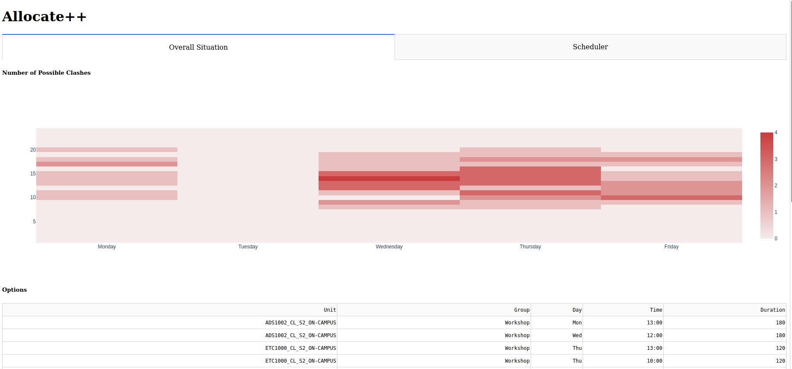
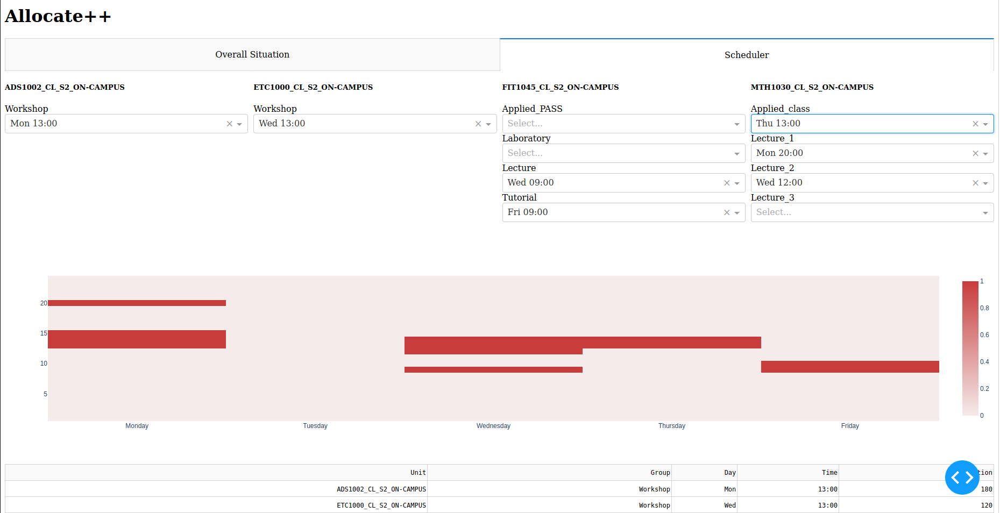

# Allocate++
Tired of looking at dozens of potential uni preferences on allocate+ and struggling to decide what to enter in?
*Don't worry*, Allocate++ gives you an **interactive rundown of when clashes are most likely to occur** and allows you to visually **add/remove classes** till you find a schedule which you're willing to signup to*!

This dashboard was made using [Python](https://www.python.org/), [Dash](https://dash.plotly.com/), [Plotly](https://plotly.com/) (for graphs), [Selenium](https://selenium-python.readthedocs.io/) (for web scraping) and [Pandas](https://pandas.pydata.org/) (for dataframe functionality).
The data is scrapped after you log into allocate+ and stored on your local machine (where all computation takes place).

Disclaimer, this tool is only for Monash University students and requires you to log into your account.
I created Allocate++ over a weekend to simplify my life, and so it is not an official Monash tool.
It does not "decide", "suggest" or "submit" your preferences.
Instead, Allocate++ allows you to visually get a feel for what your schedule will look like, so you can be prepared for your classes!
